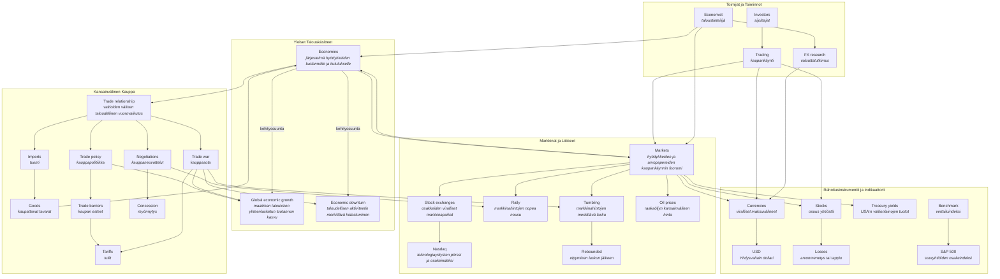

```mermaid
graph TD
    subgraph Yleiset_Talouskasitteet ["Yleiset Talouskäsitteet"]
        ECONOMIES["Economies<br/><i>järjestelmä hyödykkeiden tuotannolle ja kulutukselle</i>"]
        GEG["Global economic growth<br/><i>maailman talouksien yhteenlasketun tuotannon kasvu</i>"]
        ED["Economic downturn<br/><i>taloudellisen aktiviteetin merkittävä hidastuminen</i>"]

        ECONOMIES -->|kehityssuunta| GEG
        ECONOMIES -->|kehityssuunta| ED
    end

    subgraph Markkinat ["Markkinat ja Liikkeet"]
        MARKETS["Markets<br/><i>hyödykkeiden ja arvopapereiden kaupankäynnin foorumi</i>"]
        STOCK_EXCHANGES["Stock exchanges<br/><i>osakkeiden viralliset markkinapaikat</i>"]
        NASDAQ["Nasdaq<br/><i>teknologiayritysten pörssi ja osakeindeksi</i>"]

        RALLY["Rally<br/><i>markkinahintojen nopea nousu</i>"]
        TUMBLING["Tumbling<br/><i>markkinahintojen merkittävä lasku</i>"]
        REBOUNDED["Rebounded<br/><i>elpyminen laskun jälkeen</i>"]
        OIL["Oil prices<br/><i>raakaöljyn kansainvälinen hinta</i>"]

        MARKETS --> STOCK_EXCHANGES
        STOCK_EXCHANGES --> NASDAQ
        MARKETS --> RALLY
        MARKETS --> TUMBLING
        TUMBLING --> REBOUNDED
        MARKETS --> OIL
    end

    subgraph Rahoitus ["Rahoitusinstrumentit ja Indikaattorit"]
        STOCKS["Stocks<br/><i>osuus yhtiöstä</i>"]
        CURRENCIES["Currencies<br/><i>viralliset maksuvälineet</i>"]
        USD["USD<br/><i>Yhdysvaltain dollari</i>"]
        YIELDS["Treasury yields<br/><i>USA:n valtionlainojen tuotot</i>"]
        LOSSES["Losses<br/><i>arvonmenetys tai tappio</i>"]
        BENCHMARK["Benchmark<br/><i>vertailuindeksi</i>"]
        SP500["S&P 500<br/><i>suuryhtiöiden osakeindeksi</i>"]

        CURRENCIES --> USD
        BENCHMARK --> SP500
        STOCKS --> LOSSES
        MARKETS --> STOCKS
        MARKETS --> CURRENCIES
        MARKETS --> YIELDS
    end

    subgraph Kauppa ["Kansainvälinen Kauppa"]
        TRADE["Trade relationship<br/><i>valtioiden välinen taloudellinen vuorovaikutus</i>"]
        IMPORTS["Imports<br/><i>tuonti</i>"]
        GOODS["Goods<br/><i>kaupattavat tavarat</i>"]
        POLICY["Trade policy<br/><i>kauppapolitiikka</i>"]
        BARRIERS["Trade barriers<br/><i>kaupan esteet</i>"]
        TARIFFS["Tariffs<br/><i>tullit</i>"]
        NEGOTIATIONS["Negotiations<br/><i>kauppaneuvottelut</i>"]
        CONCESSION["Concession<br/><i>myönnytys</i>"]
        WAR["Trade war<br/><i>kauppasota</i>"]

        TRADE --> IMPORTS
        IMPORTS --> GOODS
        TRADE --> POLICY
        POLICY --> BARRIERS
        BARRIERS --> TARIFFS
        TRADE --> NEGOTIATIONS
        NEGOTIATIONS --> CONCESSION
        TRADE --> WAR
        WAR --> TARIFFS
    end

    subgraph Toimijat ["Toimijat ja Toiminnot"]
        INVESTORS["Investors<br/><i>sijoittajat</i>"]
        TRADING["Trading<br/><i>kaupankäynti</i>"]
        ECONOMIST["Economist<br/><i>taloustieteilijä</i>"]
        FX_RESEARCH["FX research<br/><i>valuuttatutkimus</i>"]

        INVESTORS --> TRADING
        TRADING --> MARKETS
        TRADING --> STOCKS
        TRADING --> CURRENCIES
        ECONOMIST --> FX_RESEARCH
        FX_RESEARCH --> CURRENCIES
        ECONOMIST --> ECONOMIES
        ECONOMIST --> MARKETS
    end

    ECONOMIES --> MARKETS
    MARKETS --> ECONOMIES
    ECONOMIES --> TRADE
    POLICY --> GEG
    WAR --> GEG
    WAR --> ED
    NEGOTIATIONS --> RALLY
    WAR --> TUMBLING
    GOODS --> ECONOMIES
```
