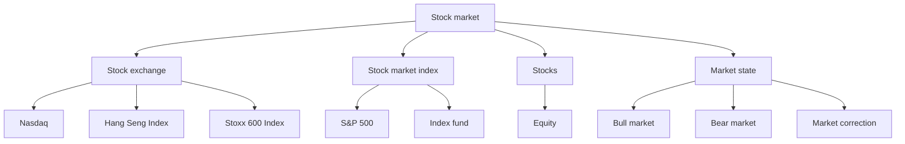

```mermaid
%% Stock Market Cluster
graph TD
    StockMarket["Stock market"] --> StockExchange["Stock exchange"]
    StockExchange --> Nasdaq["Nasdaq"]
    StockExchange --> HangSeng["Hang Seng Index"]
    StockExchange --> Stoxx600["Stoxx 600 Index"]
    StockMarket --> StockIndex["Stock market index"]
    StockIndex --> SP500["S&P 500"]
    StockIndex --> IndexFund["Index fund"]
    StockMarket --> Stocks["Stocks"]
    Stocks --> Equity["Equity"]
    StockMarket --> MarketState["Market state"]
    MarketState --> BullMarket["Bull market"]
    MarketState --> BearMarket["Bear market"]
    MarketState --> Correction["Market correction"]
```
