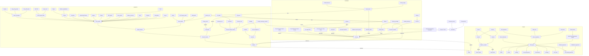

```mermaid
graph TD
    %% ======= ECONOMY CLUSTER =======
    subgraph ECONOMY
        direction TB
        ECO["Economy"]
        GDP["Gross Domestic Product (GDP)"] -->|metric of| ECO
        GNP_GNI["Gross National Product / Income"] --> ECO
        PCGDP["Per capita GDP"] --> ECO
        CPI["Consumer Price Index (CPI)"] -->|price level| ECO
        Inflation -->|rises in| CPI
        Deflation -->|falls in| CPI
        Recession -.->|period of| ECO
        EconDown["Economic downturn"] -.-> ECO
        GEG["Global economic growth"] -.-> ECO
        Monetary_policy -->|steers| ECO
        Fiscal_policy -->|steers| ECO
        Stimulus_package --> Fiscal_policy
        Central_bank --> Monetary_policy
        Federal_Reserve --> Central_bank
        Money_supply --> Central_bank
        Economic_indicator --> ECO
        Leading_indicators --> Economic_indicator
        Forecast --> Economic_indicator
        Outlook --> Forecast
    end

    %% ======= MARKETS CLUSTER =======
    subgraph MARKETS
        direction TB
        MAR["Markets"]
        Financial_market --> MAR
        Capital_markets --> Financial_market
        Stock_market --> Capital_markets
        Bond_market --> Capital_markets
        Commodity --> Financial_market
        FX["Foreign exchange market"] --> Financial_market
        Energy_sector -- supplies --> Commodity
        Oil_prices -- priced in --> Commodity
        Stock_exchanges --> Stock_market
        Nasdaq --> Stock_exchanges
        Hang_Seng_Index --> Stock_exchanges
        Stoxx_600_index --> Stock_exchanges
        Stock_market_index --> Stock_market
        SP500["S&P 500"] --> Stock_market_index
        Stocks --> Stock_market
        Equity --> Stocks
        Securities --> Stock_market
        Bonds --> Bond_market
        US_Treasury_yields --> Bond_market
        Index_fund --> Stock_market_index
        Market_capitalization --> Stocks
        IPO["Initial Public Offering"] --> Stock_market
        Broker --> Stock_market
        Trading --> Stock_market
        Portfolio --> Investors
        Risk_management --> Investors
        Bull_market --> Stock_market
        Bear_market --> Stock_market
        Market_correction --> Stock_market
        Rally --> Stock_market
        Tumbling --> Stock_market
        Rebounded --> Stock_market
        Losses --> Stock_market
        Profit --> Stocks
        Benchmark --> Bond_market
        Interest_rate --> Bond_market
        Exchange_rate --> FX
        Currencies --> FX
        US_dollar --> Currencies
        Currency_risk --> FX
        Hedging --> Risk_management
        Foreign_exchange_research --> FX
    end

    %% ======= TRADE CLUSTER =======
    subgraph TRADE
        direction TB
        TRA["Trade"]
        Imports --> Balance_of_trade
        Exports --> Balance_of_trade
        Balance_of_trade -->|surplus| Trade_surplus
        Balance_of_trade -->|deficit| Trade_deficit
        Goods --> Imports
        Services --> Imports
        Goods --> Exports
        Services --> Exports
        Trade_relationship --> Trade_policy
        Trade_policy --> Tariffs
        Trade_policy --> Quota
        Trade_policy --> Subsidy
        Trade_policy --> Non_tariff_barriers
        Trade_policy --> Protectionism
        Trade_policy --> Dumping
        Trade_policy --> Fair_trade
        Trade_policy --> Free_trade_agreement
        Trade_negotiations --> Trade_policy
        Joint_statement --> Trade_negotiations
        Trade_war --> Trade_negotiations
        Concession --> Trade_negotiations
        Bilateral_agreement --> Free_trade_agreement
        Multilateral_agreement --> Free_trade_agreement
        WTO["World Trade Organization (WTO)"] --> Trade_policy
        Trade_barriers --> WTO
    end

    %% ======= GOVERNANCE & ORGS =======
    IMF["International Monetary Fund (IMF)"] -.-> ECO
    G7["Group of 7 (G7)"] -.-> ECO

    %% ======= PARTICIPANTS =======
    Investors -.-> MAR
    Economist -.-> ECO
    Economic_theory --> Economist
    Econometrics --> Economist
    Foreign_exchange_research --> Economist

    %% ======= CROSS-DOMAIN LINKS =======
    ECO -- influences --> MAR
    MAR -- interacts --> TRA
    TRA -- impacts --> ECO
    Central_bank -- sets --> Interest_rate
    Interest_rate -- affects --> Inflation
    Inflation -- influences --> MAR
    Oil_prices -- drive --> Inflation
```
